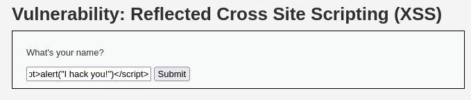
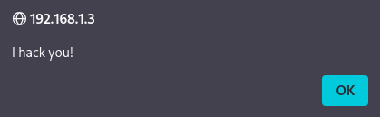
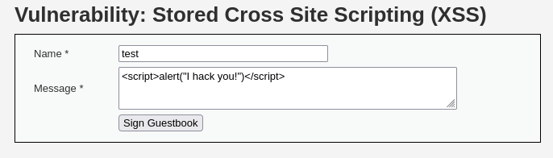
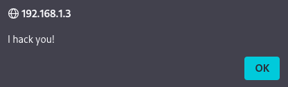
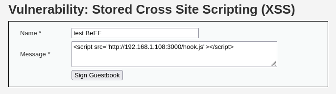
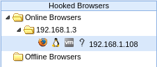

# Cross-Site Scripting (XSS)

Cross-Site Scripting (XSS) allows attackers to inject malicious JavaScript into a web page when user input is reflected or stored without proper filtering or sanitization, letting the script execute in a victim's browser and potentially steal session cookies, hijack accounts, or deface content. Covers the two main types — Reflected and Stored XSS.

## Reflected XSS

The malicious input from the user is reflected directly in the current HTTP response without being stored in the database. URL parameters or page forms are analyzed; if the input is echoed directly onto the page, a code execution test is performed.

`` → This payload is submitted into the target input field (form, URL parameter). If a pop-up appears, the input is being rendered as executable HTML without sanitization.

## Stored XSS

The malicious payload is saved directly into the database (comment field, guestbook message, profile info, etc.). Unlike Reflected XSS, it only needs to be injected once — every user who later views the page automatically executes the payload in their own browser.

`` → This payload is submitted into a persistent field (e.g. a guestbook message). Once saved, it triggers automatically for every visitor who views the page — no link-clicking required.

### Stored XSS - Advanced Exploitation (BeEF Integration)

Instead of a simple alert, a remote hook script can be embedded in the same persistent field so that every victim who visits the page has their browser session connected to the BeEF control panel — enabling cookie theft, phishing modules, and browser reconnaissance on all hooked visitors.

`` → Injected into the same persistent field used for the alert test above. Once saved, any browser loading the page automatically connects to the BeEF panel as a hooked target.

Once a browser appears under Online Browsers, the target is hooked — commands can now be executed against it directly from the BeEF control panel (cookie theft, phishing prompts, browser reconnaissance, and more).

The target is now hooked — see BeEF's control panel to run commands against it, from stealing cookies to browser reconnaissance.
